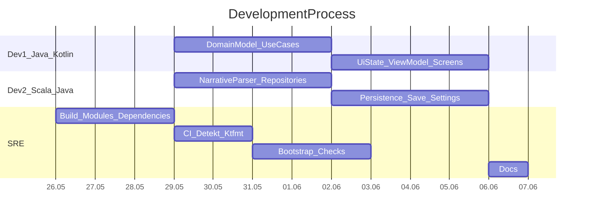

# План выполнения по архитектуре
Документ разбивает реализацию целевой архитектуры на 7 подзадач по материалам `ARCHITECTURE.md`, `TECH_STACK.md` и ролям из `rules.mdc`.
## Распределение задач
### Разработчик 1 (`Java/Kotlin`)
1. **Domain и use case слой**
   Реализовать доменные сущности, repository interfaces и use cases в `shared/commonMain/domain`: `GameState`, `Character`, `Scene`, `Choice`, `LoadSceneUseCase`, `MakeChoiceUseCase`, `EvaluateConditionsUseCase`, `SaveGameUseCase`, `LoadGameUseCase`.
2. **Presentation слой**
   Реализовать `GameUiState`, `GameViewModel` и базовые Compose-экраны игрового потока: `MainMenuScreen`, `OriginSelectScreen`, `GameScreen`, `CharacterScreen`, `SaveLoadScreen`.
### Разработчик 2 (`Scala/Java`)
3. **Narrative data слой**
   Реализовать narrative-модели, `SceneJsonParser`, `NarrativeRepositoryImpl`, чтение `index.json` и scene JSON из ресурсов Compose Multiplatform.
4. **Persistence data слой**
   Реализовать `SaveRepositoryImpl`, `SettingsRepositoryImpl`, `DatabaseDriverFactory`, SQLDelight schema и platform-specific driver wiring для Android и iOS.
### SRE
5. **Сборочная и dependency-основа**
   Подготовить Gradle/KMP-конфиг под целевой стек: Compose Multiplatform, Navigation Compose, Koin, Coroutines, SQLDelight, DataStore KMP, kotlinx.serialization-json.
6. **Качество и автоматизация**
   Настроить `GitHub Actions`, `Detekt`, `ktfmt`, а также базовые проверки сборки и тестов.
7. **Среда разработки и bootstrap**
   Подготовить единые команды запуска и тестирования для Android/iOS, а также smoke-check сценарии для локального старта проекта.
   Подготовить финальную версии документации по проекту

## Диаграмма Ганта

## Риски и меры
- Риск: задержка из-за первичной настройки KMP/Gradle/CI. Мера: сначала закрыть SRE-задачи и зафиксировать рабочий baseline сборки.
- Риск: расхождение реализации с целевой архитектурой и стеком. Мера: сверять PR с `ARCHITECTURE.md` и `TECH_STACK.md` перед merge.
- Риск: проблемы кроссплатформенной интеграции Android/iOS. Мера: проверять сборку и smoke-тесты на обеих платформах после каждой крупной задачи.
- Риск: блокировка команды из-за конфликтов в общих модулях `shared` и ресурсах. Мера: разделить зоны ответственности, работать малыми PR и регулярно синхронизировать ветки.
- Риск: отвалится 1 из участников - уже учтен- в плане  3 человека
