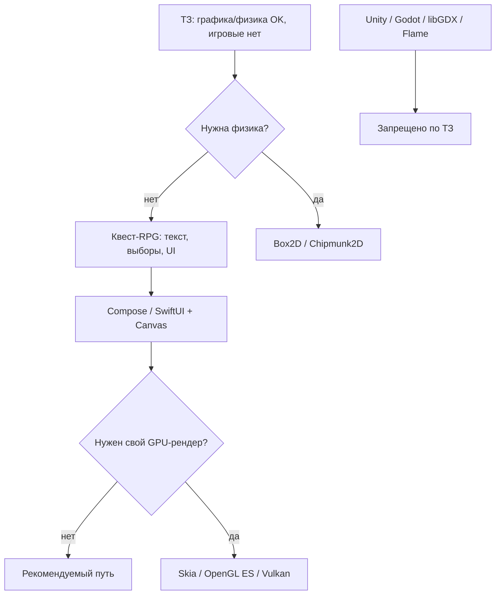
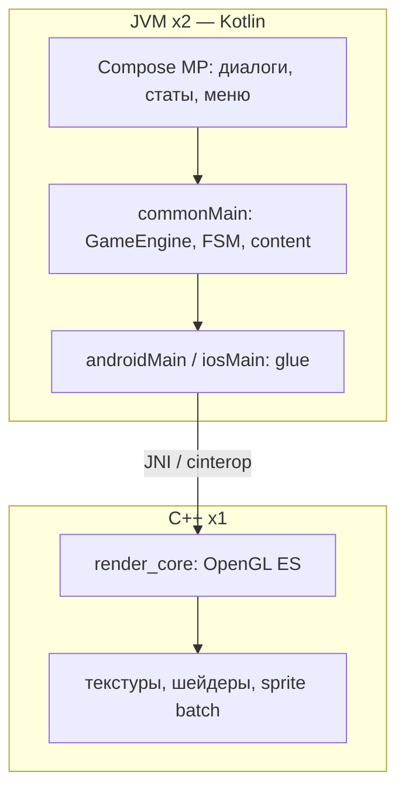
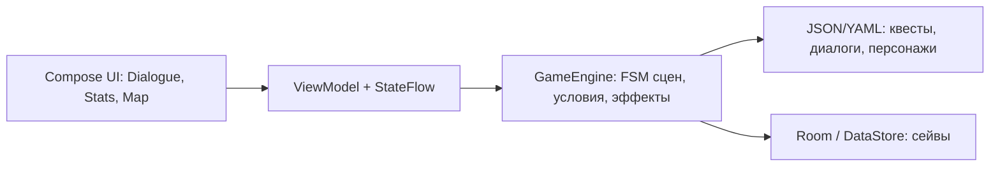

# Аналитика движков и стека

> ТЗ: «можно пользоваться графическими или физическими движками. Игровые — нельзя»

Контекст: легковесный квест-RPG в духе «Жизни и Страдания Господина Бранте» — narrative, выборы, статы, минимум real-time графики.

**Команда (факт):** 3 человека, WSL, Android Studio в окружении.
- 2 человека — **JVM** (Java/Kotlin); у одного **нет опыта с Android Studio**
- 1 человек — **C++**

> Ранее в документе фигурировал «опыт Kotlin-команды» — это была **ошибочная extrapolation** из `rules.mdc` (Android Studio + стажировки), а не заявленный состав. Ниже матрица пересчитана.

---

## 1. Трактовка ТЗ

### Классификация

| Тип | Что даёт | Примеры | По ТЗ |
|-----|----------|---------|-------|
| **Игровой движок** | редактор, сцены, game loop, ассеты, физика, аудио, билд «из коробки» | Unity, Unreal, Godot, Defold, GameMaker | **Нет** |
| **Game framework** | почти движок без редактора: спрайты, коллизии, сцены, input | libGDX, Flame, Korge, MonoGame, Cocos2d-x | **Нет** |
| **UI-фреймворк** | экраны, навигация, состояние | Jetpack Compose, SwiftUI, Flutter (без Flame) | **Да** |
| **Графический движок/lib** | только рендер 2D/3D | Skia, Canvas, OpenGL ES, Vulkan, Metal, Raylib | **Да** |
| **Физический движок** | только симуляция тел | Box2D v3, Chipmunk2D, boks2d (KMP) | **Да** |

**Игровой движок** — вы собираете игру в готовой среде, а не пишете приложение.

**Графический / физический** — узкая библиотека под одну задачу. Логику квестов, экраны, сейвы — пишете сами.

### Схема выбора



Для «Бранте» путь: **нет физики → Compose + Canvas → готово**. GPU-библиотеки и физику подключаем только при появлении соответствующих фич.

---

## 2. Современные технологии (2025–2026)

### 2.1 UI и приложение

**Jetpack Compose (Android)**
- Стандарт UI на Android; `Canvas` / `Modifier.drawBehind` для 2D
- Game loop: `withFrameNanos` — [Asteroids на Compose](https://dev.to/kotlin/how-i-built-an-asteroids-game-using-jetpack-compose-for-desktop-309l), [Riddle Pop](https://github.com/pranav-wakode/riddle-pop) (particle system, puzzle engines на Canvas)
- Подходит для card/RPG/quest: [Arcana на Compose Multiplatform](https://medium.com/@cliffrob25/how-i-built-a-roguelike-rpg-with-compose-multiplatform-and-skipped-traditional-engines-c19c3fc6e310)

**Compose Multiplatform (Android + iOS)**
- iOS stable с **1.8.0** (май 2025), актуальная ветка **1.11.0** (май 2026) — [release notes](https://github.com/JetBrains/compose-multiplatform/releases/tag/v1.11.0)
- Требования: Kotlin 2.1+ (для 1.11 — 2.2+), macOS + Xcode для iOS
- [StickerExplode](https://aditlal.dev/building-stickerexplode-part-1-gestures-physics-and-making-stickers-feel-real/) — чистый Compose, AGSL shaders, DataStore, без game engine

**Flutter (без Flame)**
- UI-фреймворк, `CustomPainter` для 2D
- [Бенчмарк filiph.net](https://filiph.net/text/benchmarking-flutter-flame-unity-godot.html): vanilla Flutter хорош для «low-intensity games» (Slay the Spire, Papers Please, Fallen London) — близко к жанру «Бранте»
- **Flame — game engine, не брать**

**SwiftUI (iOS-only)**
- Аналог Compose; если команда пойдёт только на iOS

### 2.2 Графические движки / библиотеки

| Технология | **Язык** | Версия / статус | Платформы | Когда нужна | Риск для ТЗ |
|------------|----------|-----------------|-----------|-------------|-------------|
| **Skia** | **C++** (ядро); Kotlin/Java через Android API; Rust — [rust-skia](https://github.com/rust-skia/rust-skia) | production, Vulkan backend | Android, iOS (CMP), Desktop | Низкоуровневый 2D; под капотом Compose/Chrome | Низкий — graphics lib |
| **Canvas (Compose)** | **Kotlin** | встроен | Android | UI, портреты, простые эффекты | Нет |
| **Canvas (Android View)** | **Kotlin / Java** | встроен | Android | То же без Compose | Нет |
| **CustomPainter (Flutter)** | **Dart** | встроен | Android, iOS | 2D во Flutter | Нет (если без Flame) |
| **OpenGL ES 3.0** | **C / C++** (native); Kotlin/Java — Android `GLES*` API + JNI при необходимости | стандарт mobile | Android, iOS | Sprite batching, свой рендер | Нет |
| **Vulkan** | **C / C++** | через Skia или NDK | Android N+ | Тяжёлый GPU-рендер | Нет, overkill |
| **Metal** | **Objective-C / Swift**, C++ | native iOS | iOS | GPU на Apple | Нет, overkill |
| **AGSL shaders** | **GLSL-подобный** (Android Shader Language) | Android 13+ | Android | Shimmer, transitions в Compose | Нет |
| **Raylib** | **C** (C++ совместим) | **5.5** | Android, Desktop, Web; iOS — нет официального пути | Минималистичный 2D/3D рендер | Низкий — graphics lib, **зона C++-участника** |
| **SDL2** | **C** | stable | Android, iOS, Desktop | Окно, input, поверхность для OpenGL | Низкий — multimedia lib |
| **bgfx** | **C++** | stable | Android, iOS, Desktop | Абстракция над GPU API | Низкий — rendering lib |
| **Cairo** | **C** | stable | Linux, можно через NDK | Векторная 2D-графика | Низкий |
| **CoreEngine** | **Kotlin** | Android-first | Android | ECS + Canvas/OpenGL | Формально OK, overkill |

### 2.3 Физические движки

| Технология | **Язык** | Версия | Интеграция | Заметки |
|------------|----------|--------|------------|---------|
| **Box2D** | **C / C++** | **v3.1.1** (Jun 2025) | JNI из Kotlin/Java | [box2d.org](https://box2d.org/documentation/) — **зона C++-участника** |
| **boks2d** | **Kotlin** (KMP-обёртка над C++) | v0.1.1 (Mar 2026) | Android + iOS + Desktop | [github.com/joaomcl/boks2d](https://github.com/joaomcl/boks2d) |
| **Chipmunk2D** | **C**; Obj-C на iOS | v7, MIT | native / JNI | Mobile-optimized ([chipmunk-physics.net](https://www.chipmunk-physics.net/)) |

Для narrative quest-RPG физика не нужна на MVP. Подключать только если появится мини-игра с коллизиями.

---

## 3. Запрещённые и пограничные

### Запрещено однозначно

- **Игровые движки:** Unity, Unreal, Godot, Defold, GameMaker
- **Game-фреймворки:** libGDX, Korge, Flame, MonoGame, Cocos2d-x

### Пограничные (не брать без согласования с преподом)

| Технология | Почему спорно |
|------------|---------------|
| **Kubriko** | Сам называет себя «game engine based on Compose MP» ([github](https://github.com/pandulapeter/kubriko)) — нарушает дух ТЗ |
| **libGDX** | «Cross-platform game framework» ([Game Engine Comparison 2025](https://generalistprogrammer.com/tutorials/game-engine-comparison-complete-developer-guide-2025)) |
| **Ktvn** | DSL для visual novel — OK как библиотека сценариев, не full engine ([github.com/benpollarduk/ktvn](https://github.com/benpollarduk/ktvn)) |
| **Phaser / Love2D** | Game frameworks |

---

## 4. Сравнение стеков (под реальный состав)

**JVM ×2 + C++ ×1.** Решение по платформе отложено.

### Вариант A: Android, Kotlin + Compose (baseline)

```
Kotlin 2.x + Jetpack Compose + Navigation + Room + kotlinx.serialization
Рендер: Compose UI + Canvas
Роли: JVM — UI + game logic; C++ — опционально native-модуль (JNI), контент-пайплайн
```

| + | − |
|---|---|
| JVM-опыт переносится (Java → Kotlin быстро) | Один человек учит Android Studio с нуля |
| Compose хорош для narrative UI | Compose — новый парадигм даже для Java-ников |
| C++-участнику не обязательно тащить весь рендер | C++ может «простаивать», если не дать ему native-задачи |
| Соответствует ТЗ | |

### Вариант A′: Android, Java/Kotlin + Views (XML)

```
Kotlin или Java + XML layouts + ViewModel + Room
Рендер: стандартные View; Canvas в custom View при необходимости
```

| + | − |
|---|---|
| Проще вход для того, кто не работал с Android Studio | Менее современно, больше boilerplate |
| Много туториалов «классического» Android | Хуже для анимаций, чем Compose |
| JVM-участники быстрее стартуют | |

### Вариант B: Compose Multiplatform (Android + iOS)

| + | − |
|---|---|
| Один UI-код | Mac + Xcode; двойной порог входа |
| | Для команды с нулевым Android-опытом у одного — тяжело к дедлайну |

### Вариант C: Flutter без Flame

| + | − |
|---|---|
| Кроссплатформа | **Dart — новый язык для всех троих** |
| | Хуже ложится на JVM+C++ состав |

### Вариант D: Kotlin shell + C++ graphics (OpenGL ES / Raylib)

```
Kotlin/Java — Activity, навигация, диалоги, Room
C++ (NDK) — OpenGL ES или Raylib: фоны, эффекты, мини-игры
Связка: JNI
```

| + | − |
|---|---|
| C++-участник в деле | JNI + Gradle NDK — сложная интеграция |
| Raylib / OpenGL ES — разрешены по ТЗ | Для «Бранте» (текст + выборы) **overkill** |
| | Два стека в одном репо |
| | Только Android (без KMP) |

### Вариант E: KMP + C++ OpenGL ES (split 2 JVM + 1 C++)

```
commonMain (Kotlin):  GameEngine, FSM, квесты, JSON, модели
androidMain / iosMain: Compose MP — диалоги, инвентарь, навигация
native (C++):         OpenGL ES — viewport: фоны, портреты, эффекты, мини-игры
Связка: Android — JNI; iOS — cinterop / Obj-C++ bridge
```



**Split ролей:**

| Кто | Что пишет |
|-----|-----------|
| **JVM #1** | Gradle/KMP setup, Compose MP UI, Navigation, Room/DataStore |
| **JVM #2** | `commonMain`: FSM сцен, эффекты статов, парсинг JSON-контента, тесты |
| **C++** | `render_core/` — GL context, draw calls, шейдеры; один API для Android/iOS |

| + | − |
|---|---|
| **Лучший split под ваш состав** — каждый в своём языке | Самый сложный setup из всех вариантов |
| OpenGL ES — **разрешён** по ТЗ (graphics API, не game engine) | JNI + iOS cinterop — долгая возня на старте |
| Общая game logic в `commonMain` — не дублируется | iOS нужен Mac; один JVM без AS + KMP + NDK — тяжело |
| C++-участник полностью загружен | Для чистого narrative MVP OpenGL **не обязателен** |
| C++ renderer переиспользуется на Android и iOS | Граница Kotlin↔C++ — частый источник багов |

**Когда имеет смысл:** карта мира, анимированные портреты, шейдерные переходы, real-time мини-игры — и готовы потратить 1–2 недели на glue до первого экрана.

**Когда упростить:** MVP = текст + кнопки выбора → **A/A′ без OpenGL**; C++ подключаете позже.

**Поэтапный старт (рекомендуется):**
1. Неделя 1: KMP + Compose MP, весь UI на Kotlin, game logic в `commonMain` — **без C++**
2. Неделя 2+: C++ подключает GL viewport (Android) как слой под/над диалогами
3. iOS — только если есть Mac и Android-ветка стабильна

### Матрица (пересчитана под JVM×2 + C++×1)

| Критерий | A: Compose | A′: Views | B: CMP | C: Flutter | D: JNI+C++ | **E: KMP+GL** |
|----------|:----------:|:---------:|:------:|:----------:|:----------:|:-------------:|
| Соответствие ТЗ | 5/5 | 5/5 | 5/5 | 4/5 | 5/5 | **5/5** |
| Скорость к дедлайну | 3/5 | **4/5** | 2/5 | 2/5 | 2/5 | **2/5** |
| Квест-RPG fit | 5/5 | 5/5 | 5/5 | 4/5 | 4/5 | **5/5** |
| JVM-участники (1 без AS) | 3/5 | **4/5** | 2/5 | 2/5 | 3/5 | **2/5** |
| Загрузка C++-участника | 2/5 | 2/5 | 2/5 | 1/5 | 5/5 | **5/5** |
| Split ролей 2+1 | 3/5 | 3/5 | 3/5 | 2/5 | 4/5 | **5/5** |

---

## 5. Что строим вместо движка

Вместо game engine — свои слои:



| Слой | Ответственность |
|------|----------------|
| **UI** | диалоги, инвентарь, карта, экран статов |
| **ViewModel** | состояние экрана, переживает rotation |
| **GameEngine** | FSM сцен, проверка условий, применение эффектов |
| **Content** | JSON/YAML сценарии (можно генерить нейронкой) |
| **Save** | Room / DataStore — прогресс, флаги квестов |

Ключевые паттерны:
- **FSM** для сцен и ветвлений (как в visual novel)
- **Effect system** для статов (`+honor`, `-health`, `unlock quest`)
- **Game loop** (`withFrameNanos`) — только если появятся real-time мини-игры

---

## 6. Рекомендация

| Ситуация | Выбор |
|----------|-------|
| Дедлайн близко, один без Android Studio | **A′** — Kotlin/Java + Views |
| Нужен лучший split 2 JVM + 1 C++, есть время на glue | **E** — KMP + OpenGL ES (поэтапно: сначала Kotlin, потом GL) |
| Android-only, C++ только рендер | **D** — Kotlin shell + NDK |
| Готовы учить Compose параллельно | **A** — Kotlin + Compose |
| iOS + есть Mac | **E** или **B** — KMP |

**Практичный split ролей (A или A′):**
- **JVM #1 (с Android-опытом):** Gradle, Activity, навигация, Room
- **JVM #2 (без AS):** game logic, JSON-контент, unit-тесты FSM — можно начать без эмулятора
- **C++:** native-модуль (если нужен), Box2D, asset pipeline, perf-критичные куски; иначе — контент/инструменты

Общее:
- **Движки не используем**
- **Физику не подключаем** на MVP
- **Графический движок** — только если C++-участник тянет NDK; для narrative MVP хватит Canvas/Views

### Итог для репо (baseline, пересмотренный)

```
Стек:     Kotlin (или Java), Android Views или Compose, Navigation, Room
Рендер:   View/Compose UI + Canvas; опционально C++ NDK (OpenGL ES / Raylib)
Движки:   не используем
```

---

## 7. Источники

- [Toxigon: Engine vs Framework](https://toxigon.com/gamedev-engine-vs-framework-which-to-choose)
- [Game Engine Comparison 2025](https://generalistprogrammer.com/tutorials/game-engine-comparison-complete-developer-guide-2025)
- [Compose Multiplatform 1.11.0 release](https://github.com/JetBrains/compose-multiplatform/releases/tag/v1.11.0)
- [Compose Multiplatform iOS stable (2025)](https://www.kmpship.app/blog/compose-multiplatform-ios-stable-2025)
- [Asteroids on Jetpack Compose](https://dev.to/kotlin/how-i-built-an-asteroids-game-using-jetpack-compose-for-desktop-309l)
- [Riddle Pop — Compose puzzle game](https://github.com/pranav-wakode/riddle-pop)
- [Arcana — roguelike RPG on CMP](https://medium.com/@cliffrob25/how-i-built-a-roguelike-rpg-with-compose-multiplatform-and-skipped-traditional-engines-c19c3fc6e310)
- [StickerExplode — CMP без движка](https://aditlal.dev/building-stickerexplode-part-1-gestures-physics-and-making-stickers-feel-real/)
- [Flutter vs Flame vs Unity vs Godot benchmark](https://filiph.net/text/benchmarking-flutter-flame-unity-godot.html)
- [Skia — 2D graphics library](https://skia.org/)
- [Box2D documentation](https://box2d.org/documentation/)
- [boks2d — KMP Box2D v3 bindings](https://github.com/joaomcl/boks2d)
- [Chipmunk2D Physics](https://www.chipmunk-physics.net/)
- [Kubriko — game engine on CMP](https://github.com/pandulapeter/kubriko)
- [KorGE — Kotlin game engine](https://korge.org/)
- [Ktvn — visual novel DSL](https://github.com/benpollarduk/ktvn)
- [Raylib](https://www.raylib.com/)
